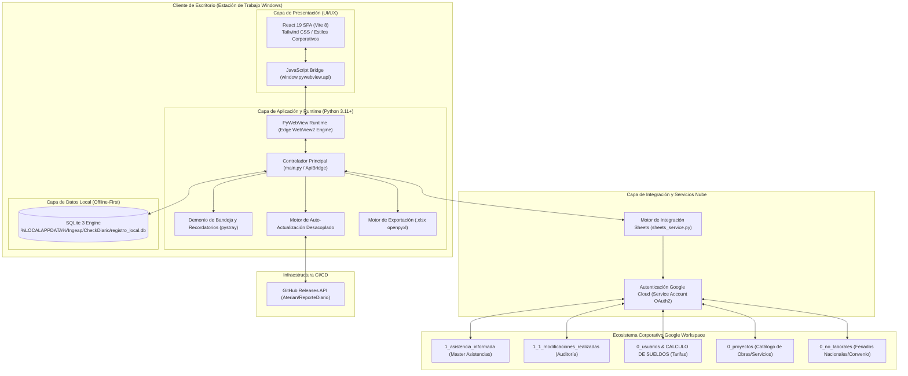
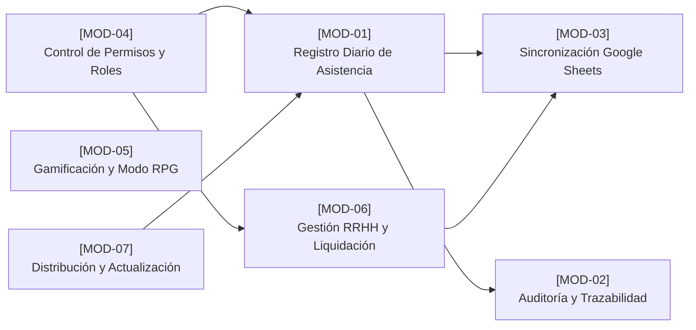
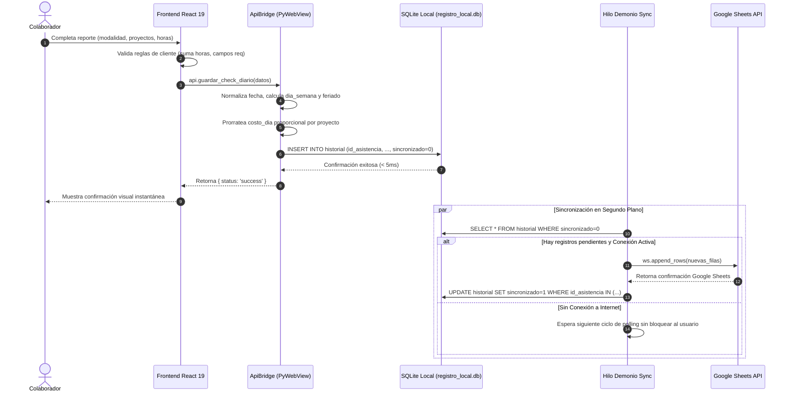
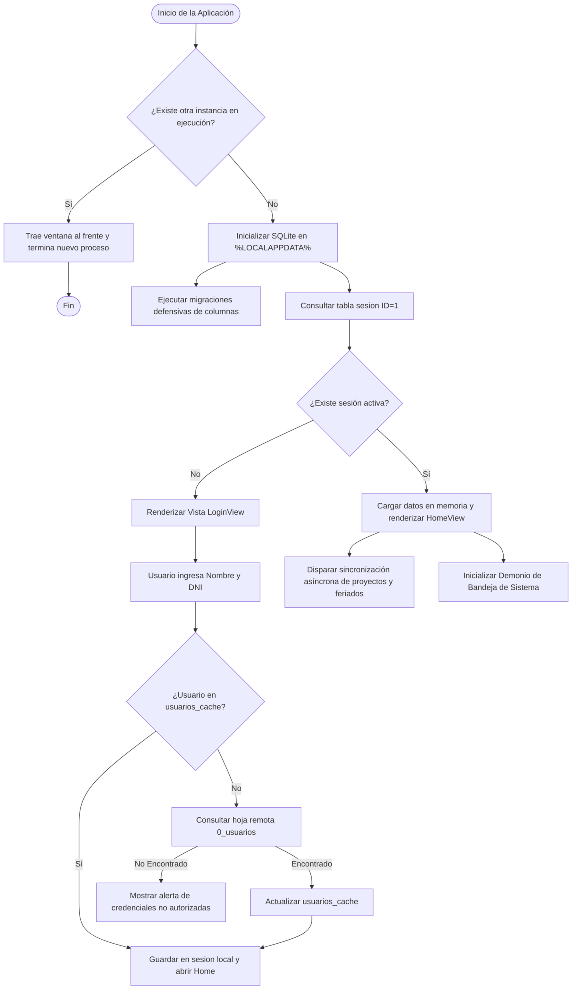
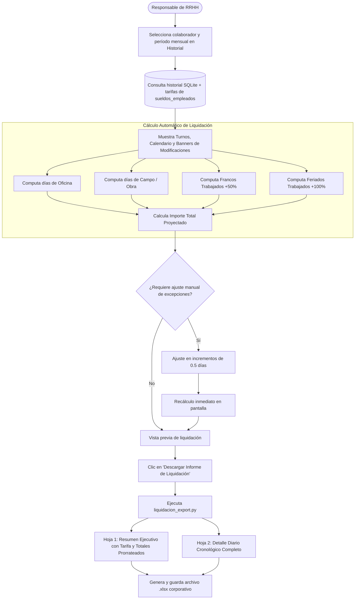
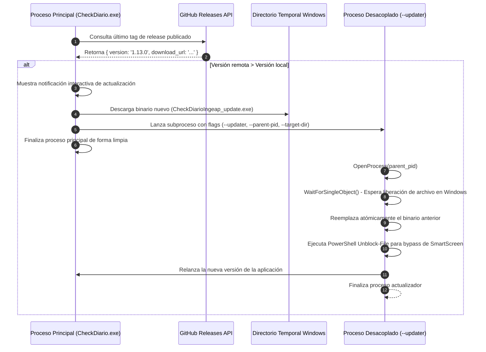

# Documento de Registro, Arquitectura y Especificación Técnica del Sistema

**Sistema:** Check Diario Ingeap  
**Versión del Software:** 1.13.0  
**Fecha de Emisión:** Octubre 2026  
**Organización:** Ingeap - Automatización, Ingeniería y Control  
**Área Responsable:** Desarrollo e Innovación de Software / Recursos Humanos  
**Estándar de Referencia:** ISO/IEC/IEEE 42010 (Architecture Description) & ISO/IEC/IEEE 29148 (Requirements Engineering)  
**Estado:** Producción / Operativo  

---

## Control de Versiones del Documento

| Versión | Fecha | Autor | Rol | Descripción del Cambio |
| :--- | :--- | :--- | :--- | :--- |
| **1.0.0** | 02/10/2026 | Equipo de Desarrollo de Software | Ing. de Software / Sistemas | Creación y consolidación de la especificación técnica, arquitectura, justificación de stack y catálogo operativo para presentación a la dirección. |

---

## 1. Resumen Ejecutivo (Executive Summary)

### 1.1. Propósito y Alcance
**Check Diario Ingeap** es una solución corporativa de software de escritorio orientada a la gestión, registro, control y liquidación de jornadas laborales, asistencia y horas imputadas a proyectos por los colaboradores de la empresa.

El sistema fue concebido para resolver las limitaciones operativas, de conectividad y de auditoría de las herramientas previas (planillas manuales no centralizadas y formularios de plataformas No-Code tipo AppSheet), proporcionando una plataforma unificada, trazable y de alto rendimiento que opera con arquitectura **Offline-First**.

### 1.2. Problemática Previa vs. Solución Implementada

```
+-------------------------------------------------------+-------------------------------------------------------+
|              Situación Previa (AppSheet / Sheets)     |             Solución Actual (Check Diario Ingeap)     |
+-------------------------------------------------------+-------------------------------------------------------+
| - Dependencia 100% de conexión constante a internet.  | - Arquitectura Offline-First con SQLite embebido.     |
| - Pérdida de reportes en zonas de campo/obra sin red. | - Cola de sincronización asíncrona tolerante a fallos.|
| - Falta de recordatorios del sistema operativo.       | - Demonio en Bandeja de Windows (System Tray).        |
| - Cálculos salariales y liquidación manuales en RRHH. | - Calculadora de liquidación con prorrateo automático.|
| - Sobreescrituras y nula trazabilidad de ediciones.   | - Auditoría integral de deltas (antes vs después).    |
| - Altos tiempos de carga e interfaces genéricas.      | - UI optimizada en React 19 (< 50ms tiempo respuesta).|
+-------------------------------------------------------+-------------------------------------------------------+
```

### 1.3. Retorno de Valor Operativo
- **Garantía de Imputación Diaria:** Reducción del 95% en reportes atrasados mediante alertas inteligentes en segundo plano integradas en Windows.
- **Transparencia en Liquidaciones:** Automatización de costos diarios de obra/oficina, recargos por feriados y francos trabajados con exportación ejecutiva a Microsoft Excel (`.xlsx`).
- **Resiliencia Operativa:** Continuidad operativa total para equipos de Mensura e Ingeniería en ubicaciones remotas sin cobertura celular.

---

## 2. Topología y Arquitectura General del Sistema

El sistema implementa el patrón **Desktop Hybrid Architecture (Single-Page Application sobre WebView Nativo)** acoplado a un motor local transaccional **Offline-First** con sincronización reactiva hacia la nube corporativa.

### 2.1. Diagrama de Arquitectura de Alto Nivel



---

## 3. Pila Tecnológica (Tech Stack) y Argumentación de Ingeniería

Cada lenguaje, framework y librería fue seleccionado mediante un análisis comparativo de rendimiento, peso en disco, huella de memoria, mantenibilidad y restricciones del entorno operativo corporativo (Windows 10/11 x64).

### 3.1. Cuadro Comparativo y Justificación del Stack

| Capa | Tecnología Seleccionada | Alternativas Descartadas | Justificación de Ingeniería |
| :--- | :--- | :--- | :--- |
| **Frontend Framework** | **React 19 + JavaScript (ESNext)** | Vanilla JS, Vue 3, Angular | Modelo de componentes declarativo, gestión reactiva de estados complejos (formularios dinámicos multiproyecto, calendarios interactivos, modales) y compatibilidad directa con el compilador React sin overhead de renderizado. |
| **Herramienta de Build** | **Vite 8** | Webpack, Create React App | Compilación ultrarrápida impulsada por Rollup/ESBuild, Hot Module Replacement (HMR) sub-segundo en desarrollo y empaquetado optimizado con tree-shaking para producción en un bundle estático ligero. |
| **Desktop Host / Bridge** | **Python 3.11+ / PyWebView 5.x** | Electron, Qt (PyQt/PySide), C# .NET WPF | **Ventaja crítica de PyWebView:** Utiliza el motor nativo ya instalado en el sistema operativo (*Microsoft Edge WebView2 / Evergreen Runtime*). Esto reduce el instalador de **~180 MB (en Electron) a solo 28 MB**, y el consumo de RAM de **~250 MB a ~50 MB**. Facilita llamadas bidireccionales síncronas/asíncronas nativas entre JS y Python. |
| **Almacenamiento Local** | **SQLite 3 (Embebido)** | IndexedDB, LocalStorage, JSON en disco | Base de datos relacional serverless con cumplimiento estricto de propiedades ACID, soporte nativo de transacciones, índices B-Tree para consultas cronológicas inmediatas y resiliencia ante cortes abruptos de energía. Permite migraciones defensivas de esquema en caliente. |
| **Integración en Nube** | **Google Cloud Service Account + `gspread`** | REST API con backend dedicado (AWS/FastAPI en VPS) | Evita costos de infraestructura cloud mensual fija (servidores dedicados o bases Postgres en la nube). Se conecta de forma transparente con los libros de cálculo utilizados por la administración y gerencia de Ingeap, permitiendo coexistencia con dashboards de Looker Studio y Google Drive. |
| **Demonio y Bandeja OS** | **Pystray + Pillow** | Win32 API directa en C++, QSystemTrayIcon | Gestión multiplataforma de íconos en la bandeja del sistema de Windows, menús contextuales desacoplados del ciclo de vida de la ventana gráfica y soporte para ejecución en segundo plano desatendida. |
| **Generación de Informes** | **Openpyxl 3.1+** | ReportLab (PDF), Pandas, XlsxWriter | Creación y formateo avanzado de libros de Microsoft Excel binarios con estilización tipográfica corporativa, paleta de colores institucional (`#C81E2B`), cálculo matemático de fórmulas y soporte de hojas múltiples (Resumen + Detalle de Auditoría). |
| **Empaquetado y Distribución** | **PyInstaller 6.22** | Inno Setup puro, MSIX, Docker Desktop | Congelación de dependencias de Python y assets del frontend precompilados en un ejecutable monolitico de alto rendimiento sin requerir que los puestos cliente tengan Python instalado. |

---

## 4. Módulos Funcionales del Sistema

El sistema se estructura en 7 módulos independientes alineados con las reglas de negocio de la organización.



### 4.1. [MOD-01] Registro de Asistencia Diaria
- **Flujo:** Permite a los colaboradores imputar su actividad diaria seleccionando modalidad (`Oficina`, `Campo / Campaña`, `Franco`, `Licencia`, `Vacaciones`).
- **Reglas de Negocio:**
  - *Jornadas Multiproyecto:* Los colaboradores pueden distribuir sus horas en múltiples proyectos en un mismo día. El sistema calcula y distribuye proporcionalmente el costo diario (`costo_dia`) para no duplicar el valor salarial de la jornada.
  - *Modalidad Campo:* Despliega selectores horarios (`hora_inicio` y `hora_fin`) con cálculo automático decimal, soportando cruces de medianoche.
  - *Francos Especializados:* Distinción automática entre *Franco de Oficina* (tarifa oficina), *Franco de Obra* (tarifa obra), *Franco Trabajado al 150%* y *Feriado Trabajado al 200%*.
  - *Calendario de No Laborales:* Detección automática de feriados nacionales o por convenio mediante la tabla remota `0_no_laborales`.

### 4.2. [MOD-02] Auditoría y Trazabilidad de Modificaciones
- **Flujo:** Monitorea cualquier cambio aplicado sobre registros históricos existentes.
- **Reglas de Negocio:**
  - Si un colaborador o personal de RRHH modifica un registro, el sistema genera un delta detallando: `tipo_antes`, `tipo_despues`, `horas_antes`, `horas_despues`, `servicio_antes`, `servicio_despues`, `quien_modifica` y marca de tiempo ISO.
  - El evento se persiste en la tabla local `modificaciones_realizadas` y se sincroniza en la hoja remota `1_1_modificaciones_realizadas`.
  - El panel de RRHH visualiza alertas interactivas con badges ámbar en el calendario para auditoría inmediata.

### 4.3. [MOD-03] Motor de Sincronización Remota Bidireccional
- **Flujo:** Coordina la transferencia de datos entre la base SQLite local y Google Sheets.
- **Reglas de Negocio:**
  - *Idempotencia y Tolerancia a Fallas:* Cada registro posee un identificador universal único (`id_asistencia` UUIDv4).
  - Si la conexión a internet es nula, el registro permanece con `sincronizado = 0`. Al restablecerse la red, el hilo de sincronización ejecuta inserciones en lote (`append_rows`) o actualizaciones in-place (`update`) mediante coincidencia por UUID.
  - *Deduplicación:* La deduplicación se realiza estrictamente por `id_asistencia`, preservando jornadas divididas legítimas (ej. 4 hs mañana y 4 hs tarde en la misma obra).

### 4.4. [MOD-04] Control de Acceso y Sistema de Roles RBAC
- **Flujo:** Define los niveles de acceso y visibilidad de los módulos de la aplicación mediante la columna `rol_app` asignada en la hoja corporativa `0_usuarios` y sincronizada en la caché local SQLite.
- **Matriz de Roles y Capacidades Operativas:**
  - **`admin` (Administrador General):** Acceso irrestricto a la totalidad del sistema (registro diario propio y delegado, historial personal y global, Roster, Calculadora de Liquidación salarial, Auditoría y revisión de modificaciones, gestión de tipos de costo, rango de fechas y configuración).
  - **`sub_admin` (Gestión de Recursos Humanos):** Acceso a registro diario e historial personal, ventana de actividad de ayer, y suite completa de gestión de RRHH (planificación de Roster, Calculadora de Liquidación, historial de otros empleados con edición y eliminación, y revisión de modificaciones).
  - **`core` (Núcleo / Supervisión Operativa):** Acceso a registro diario e historial personal con facultad para seleccionar jornada de "Campo", visualización de la ventana de actividad de ayer y acceso de **solo lectura** al historial de otros colaboradores (sin permisos de edición, eliminación, gestión de tipos de costo ni calculadora salarial).
  - **`user_1` (Colaborador Técnico de Campo):** Acceso a registro diario e historial personal con posibilidad de elegir "Campo" como tipo de día. Los días "Franco" se computan y guardan automáticamente como franco de oficina (0 hs imputadas al área), sin exposición de subtipos avanzados de franco.
  - **`user_2` (Colaborador Técnico de Oficina):** Acceso a registro diario e historial personal restringido estrictamente a modalidades de "Oficina" y "Franco" (**sin posibilidad de seleccionar "Campo"**). Los días "Franco" se computan y guardan automáticamente como franco de oficina (0 hs), sin exposición de subtipos avanzados.

```
+---------------+-------------------+-------------------+-------------------+-------------------+-------------------+
| Capacidad     | admin             | sub_admin         | core              | user_1            | user_2            |
+---------------+-------------------+-------------------+-------------------+-------------------+-------------------+
| Reg. Diario   | Completo          | Completo          | Propio            | Propio            | Propio            |
| Jornada Campo | Sí                | Sí                | Sí                | Sí                | No (Solo Oficina) |
| Tipo Franco   | Avanzado (Todos)  | Avanzado (Todos)  | Fijo (Oficina)    | Fijo (Oficina)    | Fijo (Oficina)    |
| Rango Fechas  | Sí                | Sí                | No                | No                | No                |
| Carga Delegada| Sí                | Sí                | No                | No                | No                |
| Actividad Ayer| Sí                | Sí                | Sí                | No                | No                |
| Hist. Otros   | Lectura y Edición | Lectura y Edición | Solo Lectura      | Sin Acceso        | Sin Acceso        |
| Gestión RRHH  | Roster + Liq + Mod| Roster + Liq + Mod| Sin Acceso        | Sin Acceso        | Sin Acceso        |
+---------------+-------------------+-------------------+-------------------+-------------------+-------------------+
```

### 4.5. [MOD-05] Modo Inmersivo / RPG Medieval
- **Flujo:** Interfaz temática alternativa desarrollada para el equipo de Aplicaciones y desarrollo de software, basada en un tablón medieval interactivo (*Tavern Board*), tipografías decorativas y títulos honoríficos dinámicos basados en la actividad del colaborador.

### 4.6. [MOD-06] Gestión de Roster y Calculadora de Liquidación Salarial
- **Flujo:** Módulo exclusivo para los responsables de RRHH (`Justina Bertolozzi` e `Iván Valentin`).
- **Reglas de Negocio:**
  - Conexión e introspección a la hoja salarial `CALCULO DE SUELDOS` (`sueldos_empleados`) mediante enlace relacional `id_origen`.
  - Cálculo automático de importes mensuales clasificados en 5 conceptos: *Día de Oficina*, *Día de Obra/Campo*, *Franco de Oficina Trabajado (+50%)*, *Franco de Obra Trabajado (+50%)* y *Feriado Trabajado (+100%)*.
  - Admite asignación manual en fracciones decimales de `0.5` días y exportación del informe ejecutivo a Microsoft Excel (`.xlsx`) estilizado con la identidad corporativa.

### 4.7. [MOD-07] Distribución, Inicialización del Sistema y Auto-Actualización
- **Flujo:** Inicialización del ejecutable en el arranque del sistema operativo (`HKCU\Software\Microsoft\Windows\CurrentVersion\Run`), instancia única mediante mutex y actualización automática en caliente desde GitHub Releases sin requerir privilegios de administrador del dominio.

---

## 5. Diagramas de Flujo de Procesos Críticos

### 5.1. Ciclo de Registro de Jornada Diaria y Persistencia Offline-First



### 5.2. Flujo de Autenticación, Caché y Carga Inicial



### 5.3. Flujo de Auditoría de Modificaciones y Liquidación Salarial para RRHH



### 5.4. Proceso de Auto-Actualización Desacoplada (Windows 11 Resilient)



---

## 6. Modelo de Datos y Esquema de Persistencia

### 6.1. Tablas Locales (SQLite 3)

#### Tabla: `historial` (Jornadas y Horas Imputadas)
Almacena el registro maestro de asistencia local equivalente a las columnas de la hoja remota.

| Columna | Tipo de Dato | Restricción / Default | Descripción |
| :--- | :--- | :--- | :--- |
| `id` | `INTEGER` | `PRIMARY KEY AUTOINCREMENT` | Clave interna local. |
| `id_asistencia` | `TEXT` | `NOT NULL, UNIQUE` | Identificador universal único (UUIDv4) para trazabilidad en la nube. |
| `empleado` | `TEXT` | `NOT NULL` | Nombre completo del colaborador. |
| `fecha` | `TEXT` | `NOT NULL` | Fecha de la jornada en formato ISO (`YYYY-MM-DD`). |
| `tipo_ocf` | `TEXT` | `NOT NULL` | Modalidad (`Oficina`, `Campo`, `Franco`, `Licencia`, `Vacaciones`). |
| `servicio` | `TEXT` | `NOT NULL` | Proyecto, obra o sub-área corporativa imputada. |
| `horas` | `REAL` | `DEFAULT 0.0` | Total de horas imputadas a este proyecto específico. |
| `hora_inicio` | `TEXT` | `DEFAULT ''` | Hora de entrada (obligatorio en modalidad Campo). |
| `hora_fin` | `TEXT` | `DEFAULT ''` | Hora de salida (obligatorio en modalidad Campo). |
| `tipo_costo` | `TEXT` | `DEFAULT ''` | Clasificación salarial (`Oficina` o `Campo`). |
| `costo_dia` | `REAL` | `DEFAULT 0.0` | Importe monetario prorrateado de la jornada. |
| `instrumental` | `TEXT` | `DEFAULT ''` | Equipamiento técnico asignado (ej. Estación Total, GPS). |
| `usuario_mail` | `TEXT` | `DEFAULT ''` | Correo institucional del colaborador. |
| `fecha_hora` | `TEXT` | `DEFAULT ''` | Marca de tiempo de registro original. |
| `dia_semana` | `TEXT` | `DEFAULT ''` | Día de la semana en español (`lunes`, `martes`, etc.). |
| `feriado` | `TEXT` | `DEFAULT 'NO'` | Indicador de día no laborable (`SI` / `NO`). |
| `cargado_por` | `TEXT` | `DEFAULT ''` | Identificador del operador (en caso de carga delegada de RRHH). |
| `id_empleado` | `TEXT` | `DEFAULT ''` | Código identificador en nómina corporativa. |
| `id_proyecto` | `TEXT` | `DEFAULT ''` | Clave foránea del proyecto según catálogo de obras. |
| `modificado` | `INTEGER` | `DEFAULT 0` | Bandera de edición posterior (`0` = Original, `1` = Editado). |
| `sincronizado` | `INTEGER` | `DEFAULT 1` | Estado de réplica en Sheets (`0` = Pendiente, `1` = Confirmado). |

#### Tabla: `modificaciones_realizadas` (Auditoría Forense)
Registra cada alteración de datos históricos para inspección de RRHH.

| Columna | Tipo de Dato | Restricción | Descripción |
| :--- | :--- | :--- | :--- |
| `id_modificacion` | `TEXT` | `PRIMARY KEY` | UUID único del evento de modificación. |
| `id_asistencia` | `TEXT` | `NOT NULL` | UUID del registro de asistencia afectado. |
| `tipo_antes` | `TEXT` | `DEFAULT ''` | Modalidad previa a la modificación. |
| `tipo_despues` | `TEXT` | `DEFAULT ''` | Modalidad resultante tras la modificación. |
| `horas_antes` | `REAL` | `DEFAULT 0` | Horas previas registradas. |
| `horas_despues` | `REAL` | `DEFAULT 0` | Horas actualizadas. |
| `servicio_antes` | `TEXT` | `DEFAULT ''` | Servicio o proyecto anterior. |
| `servicio_despues` | `TEXT` | `DEFAULT ''` | Servicio o proyecto nuevo. |
| `fecha_hora_modificaciones`| `TEXT` | `NOT NULL` | Timestamp ISO de la modificación. |
| `quien_modifica` | `TEXT` | `NOT NULL` | Nombre o usuario que aplicó el cambio. |
| `sincronizado` | `INTEGER` | `DEFAULT 0` | Réplica en `1_1_modificaciones_realizadas`. |
| `revisado` | `INTEGER` | `DEFAULT 0` | Estado de lectura/visado por personal de RRHH. |

#### Tabla: `usuarios_cache` (Colaboradores y Tarifas Salariales)
Caché local con tarifas sincronizadas desde `CALCULO DE SUELDOS`.

| Columna | Tipo de Dato | Descripción |
| :--- | :--- | :--- |
| `id_usuario` | `TEXT PRIMARY KEY` | Código único de empleado. |
| `nombre` | `TEXT NOT NULL` | Nombre y apellido oficial. |
| `dni` | `TEXT NOT NULL` | Documento Nacional de Identidad (clave de inicio de sesión). |
| `area` | `TEXT DEFAULT ''` | Código de área corporativa (`N`, `RRHH`, `I`, `M`, `S`, `A`, `VYM`). |
| `costo_dia_ofi` | `REAL DEFAULT 0.0` | Tarifa diaria estipulada para jornada en oficina. |
| `costo_dia_obra`| `REAL DEFAULT 0.0` | Tarifa diaria estipulada para jornada de campo/obra. |
| `id_origen` | `TEXT DEFAULT ''` | Clave de enlace relacional con el libro salarial maestro. |

---

## 7. Catálogo Visual de Interfaces con Placeholders para Capturas de Pantalla

A continuación se presentan las pantallas principales de la aplicación. Para la presentación ejecutiva final, pegue o inserte las capturas de pantalla de la aplicación en cada uno de los recuadros delimitados.

---

### 7.1. Pantalla de Acceso (Login)

> **Propósito:** Autenticación ágil mediante Nombre y DNI del colaborador, con validación local y remota contra nómina autorizada.

```
+---------------------------------------------------------------------------------------------------+
|                                                                                                   |
|                                                                                                   |
|                                    [ CAPTURA DE PANTALLA: LOGIN ]                                 |
|                                                                                                   |
|               Instrucción: Insertar captura de la vista inicial de LoginView.jsx                  |
|               Elementos clave a visualizar:                                                       |
|               - Logotipo corporativo de Ingeap.                                                   |
|               - Selector desplegable o autocompletado de Colaborador.                             |
|               - Campo táctil de DNI con placeholder '99999999'.                                   |
|               - Botón principal 'Iniciar Sesión' con diseño corporativo (#C81E2B).                |
|                                                                                                   |
|                                                                                                   |
+---------------------------------------------------------------------------------------------------+
```
*Figura 7.1: Interfaz de Autenticación y Carga de Perfil del Colaborador.*

---

### 7.2. Panel Principal (Home) y Estado Diario

> **Propósito:** Centro de control del empleado con indicador de cumplimiento del reporte del día, accesos rápidos, resumen de turnos y sincronización manual.

```
+---------------------------------------------------------------------------------------------------+
|                                                                                                   |
|                                                                                                   |
|                                  [ CAPTURA DE PANTALLA: HOME VIEW ]                               |
|                                                                                                   |
|               Instrucción: Insertar captura de HomeView.jsx con sesión iniciada.                  |
|               Elementos clave a visualizar:                                                       |
|               - Tarjeta de estado de reporte: 'Jornada Registrada' (verde) o                      |
|                 'Reporte Pendiente' (ámbar/rojo).                                                 |
|               - Accesos directos: 'Cargar Check Diario', 'Ver Mi Historial', 'Roster'.            |
|               - Widget de 'Actividad de Ayer' (para perfiles autorizados).                        |
|               - Barra de encabezado con selector de zoom (A- / A+), tema y estado de sync.        |
|                                                                                                   |
|                                                                                                   |
+---------------------------------------------------------------------------------------------------+
```
*Figura 7.2: Panel de Inicio (Home) con indicadores de estado de reporte en tiempo real.*

---

### 7.3. Formulario de Carga Diaria (CheckForm)

> **Propósito:** Registro detallado de jornada con soporte multiproyecto, franjas horarias de campo y selección de fechas.

```
+---------------------------------------------------------------------------------------------------+
|                                                                                                   |
|                                                                                                   |
|                                [ CAPTURA DE PANTALLA: CHECK FORM ]                                |
|                                                                                                   |
|               Instrucción: Insertar captura de CheckForm.jsx durante la carga de horas.           |
|               Elementos clave a visualizar:                                                       |
|               - Selector de Modalidad (Oficina, Campo, Franco, Licencia).                         |
|               - Selector de Fecha (con libertad de selección mensual).                            |
|               - Campos de franja horaria (Hora Inicio / Hora Fin) al seleccionar Campo.           |
|               - Tabla multiproyecto interactiva con desglose de horas asignadas.                  |
|               - Botón de guardado con confirmación inmediata.                                     |
|                                                                                                   |
|                                                                                                   |
+---------------------------------------------------------------------------------------------------+
```
*Figura 7.3: Formulario Mobile-First para Imputación de Proyectos y Horas.*

---

### 7.4. Historial Personal y Modal de Edición

> **Propósito:** Consulta cronológica de los últimos reportes del usuario activo y modificación in-place con registro automático de auditoría.

```
+---------------------------------------------------------------------------------------------------+
|                                                                                                   |
|                                                                                                   |
|                              [ CAPTURA DE PANTALLA: HISTORIAL PERSONAL ]                          |
|                                                                                                   |
|               Instrucción: Insertar captura de HistoryView.jsx con registros listados.            |
|               Elementos clave a visualizar:                                                       |
|               - Tabla cronológica de registros (Fecha, Modalidad, Servicio, Horas).               |
|               - Botón 'Editar' por cada fila.                                                     |
|               - Modal emergente de edición con selector tipificado de servicios (enum).           |
|               - Indicadores de sincronización con la nube (icono nube verde/gris).                |
|                                                                                                   |
|                                                                                                   |
+---------------------------------------------------------------------------------------------------+
```
*Figura 7.4: Vista de Historial Personal con capacidad de edición y trazabilidad.*

---

### 7.5. Panel de RRHH: Historial de Colaboradores y Banners de Auditoría

> **Propósito:** Auditoría y seguimiento integral de asistencia de toda la nómina por parte de RRHH y Dirección, destacando modificaciones no revisadas.

```
+---------------------------------------------------------------------------------------------------+
|                                                                                                   |
|                                                                                                   |
|                       [ CAPTURA DE PANTALLA: AUDITORÍA DE COLABORADORES RRHH ]                    |
|                                                                                                   |
|               Instrucción: Insertar captura de OtherEmployeesHistoryView.jsx.                     |
|               Elementos clave a visualizar:                                                       |
|               - Banner de alerta de modificaciones pendientes para RRHH.                          |
|               - Calendario mensual interactivo con días modificados en badge ámbar.               |
|               - Filtro rápido por empleado o listado general.                                     |
|               - Tabla comparativa de cambios (Valores anteriores vs Valores nuevos).              |
|                                                                                                   |
|                                                                                                   |
+---------------------------------------------------------------------------------------------------+
```
*Figura 7.5: Consola de Auditoría y Trazabilidad de Modificaciones para RRHH.*

---

### 7.6. Calculadora de Liquidación Salarial y Exportación Ejecutiva a Excel

> **Propósito:** Cómputo matemático de conceptos salariales (días de obra, oficina, recargos al 150% y 200%), ajustes manuales de 0.5 días y generación del informe en Excel.

```
+---------------------------------------------------------------------------------------------------+
|                                                                                                   |
|                                                                                                   |
|                     [ CAPTURA DE PANTALLA: CALCULADORA DE LIQUIDACIÓN SALARIAL ]                  |
|                                                                                                   |
|               Instrucción: Insertar captura de la tarjeta de Liquidación en RRHH.                 |
|               Elementos clave a visualizar:                                                       |
|               - Desglose de las 5 categorías (Oficina, Campo, Francos Trabajados, Feriados).      |
|               - Tarifas unitarias sincronizadas desde 'CALCULO DE SUELDOS'.                       |
|               - Controles numéricos con incrementos de '0.5' días para ajustes manuales.         |
|               - Subtotales y Total a Liquidar consolidado.                                        |
|               - Botón 'Descargar Informe' corporativo en formato .xlsx.                           |
|                                                                                                   |
|                                                                                                   |
+---------------------------------------------------------------------------------------------------+
```
*Figura 7.6: Calculadora Salarial y Módulo de Exportación de Informes Ejecutivos.*

---

### 7.7. Roster de Planificación Operativa

> **Propósito:** Visualización y carga de cronogramas futuros de turnos, guardias, licencias y períodos de campaña.

```
+---------------------------------------------------------------------------------------------------+
|                                                                                                   |
|                                                                                                   |
|                               [ CAPTURA DE PANTALLA: ROSTER OPERATIVO ]                           |
|                                                                                                   |
|               Instrucción: Insertar captura de RosterView.jsx.                                    |
|               Elementos clave a visualizar:                                                       |
|               - Cronograma mensual tipo Gantt / Calendario de turnos por colaborador.             |
|               - Distinción cromática por tipo de turno (Campaña, Franco, Licencia, Vacaciones).   |
|               - Formulario para asignación de bloques y proyectos.                                |
|                                                                                                   |
|                                                                                                   |
+---------------------------------------------------------------------------------------------------+
```
*Figura 7.7: Tablero de Planificación de Rosters y Guardias Operativas.*

---

### 7.8. Modo Inmersivo / Tablón de la Taberna (Área de Aplicaciones)

> **Propósito:** Vista temática medieval diseñada para incentivar la participación y dinamismo del equipo de software e ingeniería de aplicaciones.

```
+---------------------------------------------------------------------------------------------------+
|                                                                                                   |
|                                                                                                   |
|                                  [ CAPTURA DE PANTALLA: TEMA RPG ]                                |
|                                                                                                   |
|               Instrucción: Insertar captura de RpgTavernBoard.jsx en ejecución.                   |
|               Elementos clave a visualizar:                                                       |
|               - Estructura de Tablón de Madera con herrajes de hierro forjado y pergamino.        |
|               - Títulos honoríficos medievales asignados al colaborador.                          |
|               - Accesos temáticos: 'Crónicas de Compañeros', 'Decreto de Guardias'.              |
|                                                                                                   |
|                                                                                                   |
+---------------------------------------------------------------------------------------------------+
```
*Figura 7.8: Interfaz Temática Inmersiva (Tavern Board) exclusiva para Aplicaciones.*

---

### 7.9. Bandeja del Sistema (System Tray) y Alertas en Segundo Plano

> **Propósito:** Demonio de recordatorio desatendido en la barra de tareas de Windows.

```
+---------------------------------------------------------------------------------------------------+
|                                                                                                   |
|                                                                                                   |
|                           [ CAPTURA DE PANTALLA: SYSTEM TRAY Y RECORDATORIO ]                     |
|                                                                                                   |
|               Instrucción: Capturar el área de notificación de Windows (junto al reloj).          |
|               Elementos clave a visualizar:                                                       |
|               - Ícono oficial de Check Diario (calendario rojo Ingeap).                           |
|               - Menú contextual: 'Abrir Check Diario', 'Sincronizar Ahora', 'Salir'.              |
|               - Notificación emergente toast de Windows: 'Recordatorio: ¿Cargaste tu Check?'.     |
|                                                                                                   |
|                                                                                                   |
+---------------------------------------------------------------------------------------------------+
```
*Figura 7.9: Integración en la Bandeja del Sistema (System Tray) y notificaciones de escritorio.*

---

## 8. Seguridad, Integridad y Auditoría de Datos

### 8.1. Gestión de Credenciales y Autenticación
- **Principio de Mínimo Privilegio:** La conexión a Google Cloud Platform se realiza mediante una cuenta de servicio (`Service Account`) con permisos acotados exclusivamente al Google Drive y hojas de cálculo específicas de Ingeap.
- **Protección de Secretos:** El archivo JSON de credenciales de la cuenta de servicio y las configuraciones de entorno no se exponen al usuario final ni se almacenan en texto plano en directorios temporales compartidos; residen en `%LOCALAPPDATA%\Ingeap\CheckDiario` con descriptores de seguridad por usuario de Windows.
- **Acceso Salarial Restringido:** Las tarifas monetarias (`costo_dia_ofi`, `costo_dia_obra`) y la calculadora de liquidación están restringidas a nivel de código y de interfaz a los usuarios autorizados de Recursos Humanos (`Justina Bertolozzi` e `Iván Valentin`), ocultándose para el resto del personal.

### 8.2. Integridad Transaccional y Atomicidad
- Todas las operaciones locales en SQLite se ejecutan bajo bloques de contexto transaccional (`with obtener_conexion() as conn:`). Si ocurre una falla imprevista en el equipo del colaborador (ej. corte de energía o apagado abrupto), la base de datos ejecuta un *rollback* determinista asegurando consistencia sin corrupción de ficheros.
- La confirmación en Google Sheets se realiza de forma confirmatoria: un registro solo se etiqueta como `sincronizado = 1` una vez que la API de Google retorna código HTTP 200 con el rango de celdas impactadas.

---

## 9. Despliegue, Empaquetado y Distribución

### 9.1. Pipeline de Compilación y Distribución
El proceso de construcción y empaquetado para distribución empresarial se ejecuta a través del script automatizado [compilar_instalador.bat](file:///d:/Proyectos%20Ingeap/Ingeap/Reporte%20diario/compilar_instalador.bat):

1. **Compilación de Frontend:**
   ```bash
   cd frontend && npm run build
   ```
   Genera el bundle estático en `frontend/dist/` (HTML, JS minificado, CSS purgado, assets en Base64/SVG).
2. **Congelación de Binarios con PyInstaller:**
   ```bash
   pyinstaller backend/CheckDiarioIngeap.spec --clean --noconsole
   ```
   Empaqueta el runtime de Python, módulos C nativos, PyWebView y el directorio `frontend/dist/` en `CheckDiarioIngeap.exe` (~28 MB).
3. **Generación del Instalador Autónomo:**
   El ejecutable `Instalador_CheckDiario_Ingeap.exe` auto-extrae el binario en `%LOCALAPPDATA%\Ingeap\CheckDiario\bin`, configura los accesos directos en el Escritorio y Menú Inicio, y registra la clave de inicio automático en el registro de Windows (`HKCU\Software\Microsoft\Windows\CurrentVersion\Run`).

### 9.2. Mecanismo de Actualización Desatendida
- Al iniciar o periódicamente en segundo plano, la aplicación consulta la API pública de GitHub Releases (`https://api.github.com/repos/Aterian/ReporteDiario/releases/latest`).
- Si detecta una versión superior al tag local (ej. `1.13.0`), descarga el binario actualizado y ejecuta el modo `--updater` desacoplado, garantizando que el usuario siempre cuente con la última versión operativa sin requerir asistencia del equipo de TI.

---

## 10. Conclusiones y Hoja de Ruta (Roadmap)

### 10.1. Conclusión Técnica
**Check Diario Ingeap** consolida un salto cualitativo sobre el modelo previo basado en AppSheet. La adopción de **React 19** sobre **PyWebView (Edge WebView2)** y **SQLite** brinda a la empresa:
- Velocidad de respuesta instantánea (< 50ms).
- Disponibilidad 100% en zonas geográficas sin red.
- Automatización integral de la liquidación salarial mensual con exportaciones auditables a Excel.
- Trazabilidad forense completa de todas las modificaciones de turnos.
- Cero costo recurrente de licenciamiento No-Code o servidores dedicados.

### 10.2. Hoja de Ruta Tecnológica (Roadmap)
- **Fase 2 (Q1 2027):** Migración del repositorio central remoto desde Google Sheets hacia **PostgreSQL 16 (vía Supabase / Cloud)** con endpoints asíncronos en **FastAPI**, conservando el cliente de escritorio intacto gracias a la abstracción de `ApiBridge`.
- **Fase 3 (Q2 2027):** Incorporación de módulo para adjuntar fotografías de campo y remitos de instrumental mediante subida directa a almacenamiento de objetos **Cloudflare R2** vía URLs prefirmadas.
- **Fase 4 (Q3 2027):** Progressive Web App (PWA) móvil complementaria para colaboradores en tránsito que no utilicen estaciones Windows.

---

*Documento técnico emitido para revisión de la Dirección y Gerencia General de Ingeap.*  
*Fin del Documento de Registro.*
